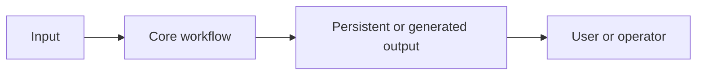

# [Project name]: technical case study

| Evidence boundary | Value |
| --- | --- |
| Canonical source | Git repository |
| Source revision | `[commit, tag, or explicitly labeled working tree]` |
| Last verified | `[YYYY-MM-DD]` |
| Deployment status | `[not deployed, deployed, or unknown]` |

## Scope and evidence boundary

[Define the included product scope, excluded scope, source revision, and evidence types used.]

## Problem context and constraints

[Describe the original problem, users, operational constraints, privacy requirements, and delivery constraints.]

## Architecture

[Explain the important component boundaries and why they exist.]

## Domain model and invariants

| Concept | Meaning | Invariant |
| --- | --- | --- |
| [Concept] | [Definition] | [Rule that must remain true] |

## Key decisions

### [Decision]

- Context: [Relevant constraint.]
- Decision: [Chosen approach.]
- Trade-off: [Benefit and accepted cost.]
- Evidence: [File, test, or runtime observation.]

## Failure boundaries

| Failure | Detection | Safe behavior | Recovery |
| --- | --- | --- | --- |
| [Failure mode] | [Signal] | [Contained behavior] | [Operator action] |

## Security and privacy

- Data classification: [public, internal, private, secret]
- Credential handling: [where secrets live and how they are protected]
- Publication boundary: [what must never enter generated documents]

## Testing and verification

| Layer | Command or check | Result | Remaining uncertainty |
| --- | --- | --- | --- |
| [Unit, integration, build, runtime] | `[command]` | [Passed, failed, skipped] | [Gap] |

## Operations and recovery

1. [Deployment or publication trigger.]
2. [Health or correctness verification.]
3. [Rollback or rerun procedure.]
4. [Escalation condition.]

## Known limitations and next steps

| Item | Current impact | Next step | Priority |
| --- | --- | --- | --- |
| [Limitation or debt] | [Impact] | [Concrete action] | [High, medium, low] |

## Related documents

- [Project overview](./Project_Overview.md)
